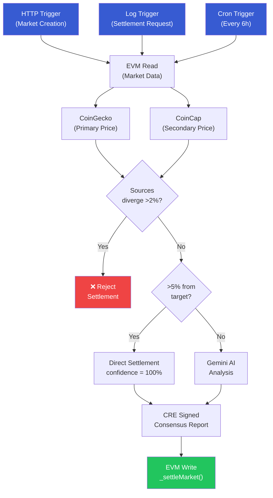
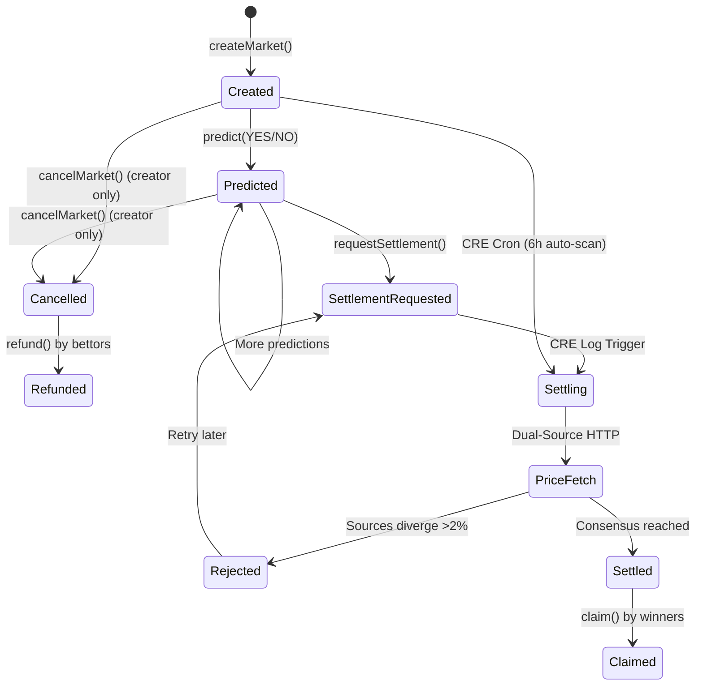

# OracleSettler: Real-Data + AI Prediction Market Resolution on CRE

Automated prediction market settlement using **dual-source price verification (CoinGecko + CoinCap)**, **AI judgment from Gemini**, and **Chainlink Runtime Environment (CRE)** for trustless, on-chain execution.

**Live Frontend**: [oracle-settler.vercel.app](https://oracle-settler.vercel.app)

---

## The Problem

Prediction markets today face a **resolution bottleneck**:

| Approach | Problem |
|----------|---------|
| **Manual resolution** | Slow, biased, single point of failure |
| **Pure AI oracles** | Hallucination-prone, no verifiable data |
| **Single price feed** | Manipulation risk, no redundancy |

## Our Solution

OracleSettler combines **three layers of trust** in a single CRE workflow:

1. **Dual-source price consensus** — CoinGecko + CoinCap cross-validated (>2% divergence = reject)
2. **Two-tier resolution** — >5% price diff = instant settlement; <5% = Gemini AI with confidence scoring
3. **CRE-signed execution** — Multi-node consensus ensures no single party can manipulate outcomes

### Who Benefits

- **Users**: Trustless settlement — no admin can alter outcomes after the fact
- **Chainlink**: Real-world CRE use case demonstrating 10 capabilities in production
- **Developers**: Reference implementation for building CRE-powered DeFi applications

---

## Architecture



### Market Lifecycle



---

## Frontend

The React frontend provides a full prediction market experience:

- **Market List**: Browse all on-chain markets with odds bars and status
- **Market Detail**: Place YES/NO predictions, request settlements, claim winnings
- **Settlement Explorer**: Step-by-step visualization of how CRE settled each market
- **Price Comparison**: Cross-platform verification (CRE vs CoinGecko vs CoinCap live)
- **Create Market**: Deploy new prediction markets with preset templates

### Running the Frontend

```bash
cd prediction-market/frontend
npm install
npm run dev    # http://localhost:5173
```

---

## Quick Start

### Prerequisites

- [Foundry](https://book.getfoundry.sh/getting-started/installation) (forge, cast)
- [Bun](https://bun.sh/) v1.0+
- [CRE CLI](https://docs.chain.link/cre) (`curl -sSL https://cre.chain.link/install.sh | sh`)
- [Node.js](https://nodejs.org/) v18+ (for frontend)
- Sepolia ETH ([faucet](https://cloud.google.com/application/web3/faucet/ethereum/sepolia))
- [Gemini API key](https://aistudio.google.com/apikey) (free)

### Setup

```bash
# Clone and install
git clone https://github.com/YuxiangJiangCT/oracle-settler.git
cd oracle-settler/prediction-market

# Configure environment
cp .env.example .env
# Edit .env with your private key and Gemini API key

# Install workflow dependencies
cd my-workflow && bun install && cd ..

# Compile contracts
cd contracts && forge build && cd ..

# Install and run frontend
cd frontend && npm install && npm run dev
```

Or use the Makefile:

```bash
make install   # Install all dependencies
make build     # Build contracts + frontend
make test      # Run all tests (35 passing)
make dev       # Start frontend dev server
```

### Deploy

```bash
forge create --broadcast \
  --rpc-url https://ethereum-sepolia-rpc.publicnode.com \
  --private-key $YOUR_PRIVATE_KEY \
  --root contracts \
  src/PredictionMarket.sol:PredictionMarket \
  --constructor-args 0x15fc6ae953e024d975e77382eeec56a9101f9f88
```

Update `my-workflow/config.staging.json` with the deployed contract address.

### Create Markets & Settle

```bash
CONTRACT=0x557542Bf475143a2f4F620E7C05bc8d913c55324
RPC=https://ethereum-sepolia-rpc.publicnode.com

# Create a BTC market
cast send --rpc-url $RPC --private-key $PK $CONTRACT \
  "createMarket(string,string,uint256)" \
  "Will BTC be above 50000 USD by March 1 2026?" "bitcoin" 50000000000

# Request settlement
cast send --rpc-url $RPC --private-key $PK $CONTRACT \
  "requestSettlement(uint256)" 0

# Run CRE workflow to settle (simulation)
cre workflow simulate my-workflow --non-interactive --trigger-index 1 \
  --evm-tx-hash <SETTLEMENT_TX_HASH> --evm-event-index 0

# Run with broadcast to settle on-chain
cre workflow simulate my-workflow --non-interactive --trigger-index 1 \
  --evm-tx-hash <SETTLEMENT_TX_HASH> --evm-event-index 0 --broadcast
```

---

## Demo: Multi-Asset Settlement

Three markets deployed and settled on Sepolia with real CoinGecko + CoinCap prices:

| Market | Asset | Question | Target | Actual Price | Outcome | Confidence |
|--------|-------|----------|--------|-------------|---------|-----------|
| #0 | BTC | Will BTC be above $100,000? | $100,000 | $63,891 | NO | 75% |
| #1 | ETH | Will ETH be above $5,000? | $5,000 | $1,853 | NO | 75% |
| #2 | SOL | Will SOL be above $200? | $200 | $79 | NO | 75% |

**Contract (Sepolia)**: [`0x557542Bf475143a2f4F620E7C05bc8d913c55324`](https://sepolia.etherscan.io/address/0x557542Bf475143a2f4F620E7C05bc8d913c55324)

---

## CRE Capabilities Used (10)

| # | Capability | Purpose |
|---|-----------|---------|
| 1 | **HTTP Trigger** | Market creation via webhook |
| 2 | **Log Trigger** | Event-driven on-demand settlement |
| 3 | **Cron Trigger** | Scheduled auto-settlement every 6 hours |
| 4 | **EVM Read** | Read market data (asset, targetPrice, pools) |
| 5 | **EVM Write** | Write signed settlement report to contract |
| 6 | **Confidential HTTP (CoinGecko)** | Primary price oracle (API key in WASM) |
| 7 | **Confidential HTTP (CoinCap)** | Secondary price oracle for dual-source consensus |
| 8 | **Confidential HTTP (Gemini AI)** | AI judgment for borderline cases |
| 9 | **Consensus Aggregation** | Multi-node agreement on price data |
| 10 | **Custom Compute** | Price threshold logic + source divergence check |

---

## Testing

35 tests covering all contract functions, World ID integration, cancel/refund, deadline enforcement, and fuzz testing:

```
$ forge test -vvv

# Market Creation (5)
[PASS] test_createMarket_succeeds
[PASS] test_createMarket_incrementsId
[PASS] test_createMarket_emitsEvent
[PASS] test_createMarket_viaCRE
[PASS] test_createMarketWithDeadline

# Predictions (8)
[PASS] test_predict_yes
[PASS] test_predict_no
[PASS] test_predict_revertsIfMarketNotExist
[PASS] test_predict_revertsIfSettled
[PASS] test_predict_revertsIfZeroValue
[PASS] test_predict_revertsIfAlreadyPredicted
[PASS] test_predict_revertsAfterDeadline
[PASS] test_predict_succeedsBeforeDeadline

# Settlement (4)
[PASS] test_requestSettlement_emitsEvent
[PASS] test_requestSettlement_revertsIfNotExist
[PASS] test_settleMarket_viaCRE
[PASS] test_settle_revertsIfAlreadySettled
[PASS] test_settle_revertsIfNotExist
[PASS] test_settle_setsAllFields

# Claims (6)
[PASS] test_claim_winnerGetsFullPool
[PASS] test_claim_proportionalPayout
[PASS] test_claim_revertsIfNotSettled
[PASS] test_claim_revertsIfAlreadyClaimed
[PASS] test_claim_revertsIfLoser
[PASS] test_claim_revertsOnCancelledMarket

# Cancel & Refund (4)
[PASS] test_cancelMarket_succeeds
[PASS] test_cancelMarket_revertsIfNotCreator
[PASS] test_cancelMarket_revertsIfSettled
[PASS] test_refund_afterCancel

# World ID (3)
[PASS] test_createMarketVerified_worksWhenWorldIdDisabled
[PASS] test_worldId_immutableIsZeroWhenDisabled
[PASS] test_createMarketVerified_withMockWorldId

# Edge Cases & Fuzz (3)
[PASS] test_onReport_rejectsUnauthorizedCaller
[PASS] test_multipleMarkets_isolation
[PASS] testFuzz_claim_proportionalPayout (256 runs)

Suite result: ok. 35 passed; 0 failed; 0 skipped
```

---

## Files Modified from Bootcamp Template

| File | Changes | Why |
|------|---------|-----|
| `contracts/src/PredictionMarket.sol` | Added `asset`, `targetPrice`, `settledPrice`, `deadline` to Market struct; `cancelMarket()`, `refund()`, `createMarketWithDeadline()`, `createMarketVerified()` (World ID); claim division-by-zero protection | Multi-asset markets, market governance, deadline enforcement, sybil resistance |
| `contracts/src/interfaces/IWorldID.sol` | **New** — World ID verification interface | Sybil-resistant market creation via ZK proof |
| `contracts/src/helpers/ByteHasher.sol` | **New** — Field hash utility | World ID external nullifier computation |
| `contracts/test/PredictionMarket.t.sol` | **New** — 35 Foundry tests (incl. fuzz + World ID) | Full coverage: creation, prediction, settlement, claims, cancel/refund, deadline, World ID, edge cases |
| `my-workflow/logCallback.ts` | Refactored to use shared settlement logic | Clean architecture, code reuse with Cron trigger |
| `my-workflow/cronCallback.ts` | **New** — Scheduled market scanner | Auto-settle expired markets without manual intervention |
| `my-workflow/settlementLogic.ts` | **New** — Dual-source price fetch + threshold + AI + write | DRY principle across triggers with dual-source consensus |
| `my-workflow/coincapPrice.ts` | **New** — CoinCap price fetcher | Second independent price source for consensus |
| `my-workflow/main.ts` | Added Cron trigger registration | Three trigger types for comprehensive automation |
| `my-workflow/httpCallback.ts` | Updated for asset + targetPrice params | Support new market creation schema |
| `frontend/` | **New** — React + TypeScript + ethers.js | Full market UI with Settlement Explorer |

---

## How It Works

1. **Market Creation**: User calls `createMarket("Will BTC be above $50K?", "bitcoin", 50000e6)` specifying the CoinGecko asset ID and target price in 6 decimals
2. **Prediction**: Users bet YES or NO by sending ETH to `predict(marketId, prediction)`
3. **Settlement Request**: Anyone calls `requestSettlement(marketId)` which emits a `SettlementRequested` event
4. **CRE Catches Event**: The Log Trigger picks up the event and initiates settlement
5. **Dual-Source Price Fetch**: CRE fetches from CoinGecko AND CoinCap via Confidential HTTP
6. **Source Consensus**: If sources diverge >2%, settlement is rejected for safety
7. **Outcome Determination**:
   - If price is >5% away from target: instant settlement (no AI needed)
   - If price is within 5%: Gemini AI analyzes with full context and provides confidence score
8. **On-Chain Settlement**: CRE signs and writes the settlement report to the smart contract
9. **Auto-Settlement**: Cron trigger runs every 6 hours to catch and settle any expired markets

---

## Tech Stack

- **Smart Contract**: Solidity 0.8.24 (Foundry) — 340 lines, 35 tests
- **Sybil Resistance**: World ID on-chain verification (Sepolia WorldIDRouter)
- **CRE Workflow**: TypeScript (Bun + CRE SDK) — 10 capabilities, 3 triggers
- **Price Oracles**: CoinGecko + CoinCap (dual-source via Confidential HTTP)
- **AI**: Google Gemini 2.0 Flash (via Confidential HTTP)
- **Frontend**: React + TypeScript + Vite + ethers.js v6 — 15 components, 1650 lines
- **Network**: Ethereum Sepolia Testnet
- **CRE Forwarder**: `0x15fc6ae953e024d975e77382eeec56a9101f9f88`
