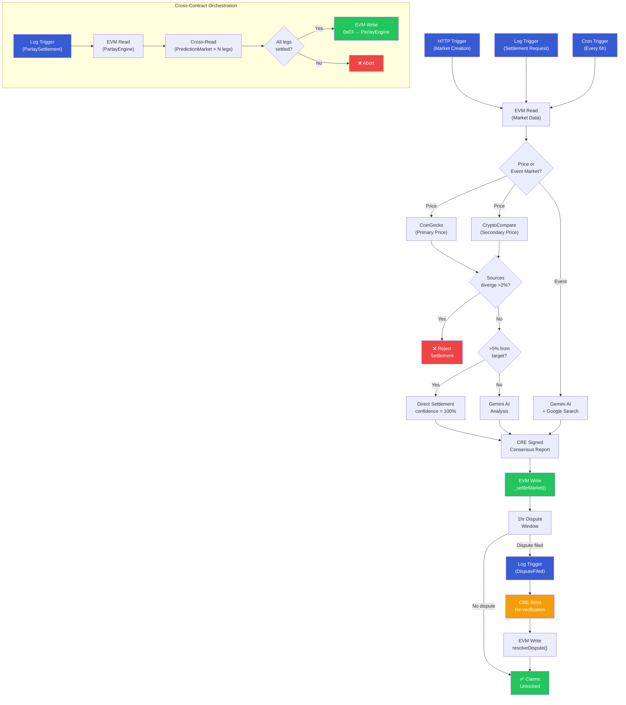
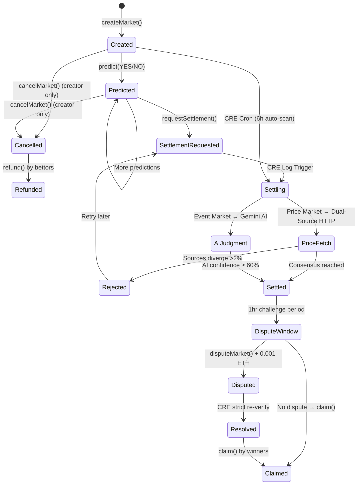

> **[Live Demo \u2192](https://oracle-settler.vercel.app)**

# OracleSettler: Real-Data + AI Prediction Market Resolution on CRE

Automated prediction market settlement using **dual-source price verification (CoinGecko + CryptoCompare)**, **AI judgment from Gemini**, **event market resolution**, **dispute arbitration**, **cross-contract parlay settlement**, and **Chainlink Runtime Environment (CRE)** for trustless, on-chain execution.

**Live Frontend**: [oracle-settler.vercel.app](https://oracle-settler.vercel.app)

**Demo Video**: [Google Drive](https://drive.google.com/file/d/1UV0V2dvN7VtaQxawSQoPJ7bNoLsBMhOD/view?usp=sharing)

---

## The Problem

Prediction markets today face a **resolution bottleneck**:

| Approach | Problem |
|----------|---------|
| **Manual resolution** | Slow, biased, single point of failure |
| **Pure AI oracles** | Hallucination-prone, no verifiable data |
| **Single price feed** | Manipulation risk, no redundancy |
| **No recourse** | Wrong settlements are permanent — users can't challenge |

## Our Solution

OracleSettler combines **four layers of trust** in a single CRE workflow:

1. **Dual-source price consensus** — CoinGecko + CryptoCompare cross-validated (>2% divergence = reject)
2. **Two-tier resolution** — >5% price diff = instant settlement; <5% = Gemini AI with confidence scoring
3. **Event markets** — Non-price questions (e.g., "Will GPT-5 launch?") resolved via Gemini AI + Google Search
4. **Dispute arbitration** — 1-hour challenge window after settlement; CRE strict re-verification with 70% confidence threshold
5. **CRE-signed execution** — Multi-node consensus ensures no single party can manipulate outcomes

### Who Benefits

- **Users**: Trustless settlement with dispute recourse — wrong outcomes can be challenged and overturned
- **Chainlink**: Real-world CRE use case demonstrating 16 capabilities across 5 triggers in production
- **Developers**: Reference implementation for building CRE-powered DeFi applications

---

## Why No Backend?

Most prediction markets require a centralized server for market data indexing, price feeds, order matching, and settlement orchestration. **OracleSettler has zero backend infrastructure** — CRE replaces the entire server stack:

| Traditional Stack | OracleSettler | Replaced By |
|-------------------|---------------|-------------|
| Express/Node.js server | None | CRE Workflow runtime |
| WebSocket event streaming | None | On-chain events + frontend polling |
| Cron job scheduler | None | CRE Cron Trigger (every 6h) |
| Price feed service | None | CRE Confidential HTTP (CoinGecko + CryptoCompare) |
| AI inference endpoint | None | CRE Confidential HTTP (Gemini) |
| Database for market state | None | Smart contract storage |
| Event indexer | None | CRE Log Triggers |
| API authentication | None | CRE KeystoneForwarder signature verification |

**The result**: No servers to maintain, no API keys to rotate, no database to back up, no single point of failure. The entire backend is a CRE workflow running on Chainlink's decentralized oracle network.

This is not a limitation — it's the point. CRE enables **serverless DeFi applications** where the oracle network IS the backend.

---

## Architecture



### Market Lifecycle



---

## Frontend

The React frontend provides a full prediction market experience:

- **Market List**: Browse all on-chain markets with odds bars, status tags (Open, Settled, Dispute Window, Cancelled)
- **Market Detail**: Place YES/NO predictions, request settlements, claim winnings
- **Settlement Explorer**: Step-by-step visualization of how CRE settled each market (price vs event path)
- **Dispute Panel**: File disputes during 1-hour window, track re-verification status, view resolution outcomes
- **Price Comparison**: Cross-platform verification (CRE vs CoinGecko vs CryptoCompare live)
- **Create Market**: Deploy new prediction markets — both price targets and free-form event questions
- **Parlays**: Combine 2-5 market predictions into combo bets with multiplied odds, CRE cross-contract settlement
- **Event Markets**: "Event Market" badge for non-price questions resolved via AI

### Running the Frontend

```bash
cd prediction-market/frontend
npm install
npm run dev    # http://localhost:5173
```

---

## Quick Start

### Prerequisites

- [Foundry](https://book.getfoundry.sh/getting-started/installation) (forge, cast)
- [Bun](https://bun.sh/) v1.0+
- [CRE CLI](https://docs.chain.link/cre) (`curl -sSL https://cre.chain.link/install.sh | sh`)
- [Node.js](https://nodejs.org/) v18+ (for frontend)
- Sepolia ETH ([faucet](https://cloud.google.com/application/web3/faucet/ethereum/sepolia))
- [Gemini API key](https://aistudio.google.com/apikey) (free)

### Setup

```bash
# Clone and install
git clone https://github.com/YuxiangJiangCT/oracle-settler.git
cd oracle-settler/prediction-market

# Configure environment
cp .env.example .env
# Edit .env with your private key and Gemini API key

# Install workflow dependencies
cd my-workflow && bun install && cd ..

# Compile contracts
cd contracts && forge build && cd ..

# Install and run frontend
cd frontend && npm install && npm run dev
```

Or use the Makefile:

```bash
make install   # Install all dependencies
make build     # Build contracts + frontend
make test      # Run all tests (84 passing)
make dev       # Start frontend dev server
```

### Deploy

```bash
forge create --broadcast \
  --rpc-url https://ethereum-sepolia-rpc.publicnode.com \
  --private-key $YOUR_PRIVATE_KEY \
  --root contracts \
  src/PredictionMarket.sol:PredictionMarket \
  --constructor-args \
    0x15fc6ae953e024d975e77382eeec56a9101f9f88 \
    0x0000000000000000000000000000000000000000 \
    "app_e5fb2e27e8b9d3c7ea376b845676f05a" \
    "create-market"
```

Constructor args: CRE Forwarder, World ID Router (0x0 to disable), World ID App ID, Action ID.

Update `my-workflow/config.staging.json` with the deployed contract address.

### Create Markets & Settle

```bash
CONTRACT=0x51CC15B53d776b2B7a76Fa30425e8f9aD2aec1a5
RPC=https://ethereum-sepolia-rpc.publicnode.com

# Create a BTC market
cast send --rpc-url $RPC --private-key $PK $CONTRACT \
  "createMarket(string,string,uint256)" \
  "Will BTC be above 50000 USD by March 1 2026?" "bitcoin" 50000000000

# Request settlement
cast send --rpc-url $RPC --private-key $PK $CONTRACT \
  "requestSettlement(uint256)" 0

# Simulate CRE workflow settlement locally
cre workflow simulate my-workflow --non-interactive --trigger-index 1 \
  --evm-tx-hash <SETTLEMENT_TX_HASH> --evm-event-index 0

# Simulate and broadcast the signed result on-chain
cre workflow simulate my-workflow --non-interactive --trigger-index 1 \
  --evm-tx-hash <SETTLEMENT_TX_HASH> --evm-event-index 0 --broadcast
```

---

## Demo: Multi-Market Settlement

Eight markets deployed on Sepolia demonstrating all resolution paths:

| Market | Type | Question | Target | Resolution Path | Status |
|--------|------|----------|--------|----------------|--------|
| #0 | Price | Will BTC be above $100,000 by March 2026? | $100K | Dual-source price + threshold | Settled |
| #1 | Price | Will ETH exceed $5,000? | $5K | Dual-source price + AI borderline | Open |
| #2 | Event | Will GPT-5 be released before July 2026? | N/A | Gemini AI + Google Search | Open |
| #3 | Price | Will SOL exceed $200 by June 2026? | $200 | Dual-source price | Open |
| #4 | Price | Will DOGE exceed $0.50 by May 2026? | $0.50 | Dual-source price + AI | Open |
| #5 | Price | Will LINK exceed $30 by April 2026? | $30 | Dual-source price | Open |
| #6 | Event | Will Apple announce Vision Pro 2 before WWDC 2026? | N/A | Gemini AI + Google Search | Open |
| #7 | Price | Will AVAX exceed $50 by July 2026? | $50 | Dual-source price | Open |

**PredictionMarket (Sepolia, verified)**: [`0x51CC15B53d776b2B7a76Fa30425e8f9aD2aec1a5`](https://sepolia.etherscan.io/address/0x51CC15B53d776b2B7a76Fa30425e8f9aD2aec1a5)

**ParlayEngine (Sepolia)**: [`0x698189C348fE75Cd288F89De021811Ff04b7dC2B`](https://sepolia.etherscan.io/address/0x698189C348fE75Cd288F89De021811Ff04b7dC2B)

---

## Tenderly Virtual TestNet

Contract tested against a Tenderly Virtual TestNet (Sepolia fork) for rapid iteration:

| Resource | Link |
|----------|------|
| **Public RPC** | `https://virtual.sepolia.eu.rpc.tenderly.co/03dfcf31-07ae-4204-879a-8f0c2a9ad16f` |

```bash
# Interact via Tenderly VTestNet fork
cast call --rpc-url https://virtual.sepolia.eu.rpc.tenderly.co/03dfcf31-07ae-4204-879a-8f0c2a9ad16f \
  0x51CC15B53d776b2B7a76Fa30425e8f9aD2aec1a5 "getNextMarketId()(uint256)"
```

---

## World ID Sybil Resistance

Market creation supports **World ID** zero-knowledge proof verification to prevent sybil attacks:

- **On-chain**: `createMarketVerified()` verifies ZK proof via WorldIDRouter on Sepolia (`0x469449f251692E0779667583026b5A1E99512157`)
- **Frontend**: IDKit widget prompts World App verification before creating market
- **Backward compatible**: Regular `createMarket()` still works for CRE-triggered workflows

Each verified human can only create one market per action (duplicate nullifier = revert).

---

## Dispute Arbitration

Settled markets enter a **1-hour dispute window** before claims are unlocked:

| Parameter | Value |
|-----------|-------|
| **Window** | 1 hour after settlement |
| **Stake** | 0.001 ETH (returned if overturned, forfeited if confirmed) |
| **Re-verification** | CRE strict mode — 70% confidence threshold |
| **Report prefix** | `0x02` (vs `0x00` creation, `0x01` settlement, `0x03` parlay) |

**How it works:**
1. User calls `disputeMarket(marketId)` with 0.001 ETH within 1 hour of settlement
2. `DisputeFiled` event triggers CRE's dispute handler
3. CRE re-runs full verification in strict mode — fetches fresh prices (or AI for event markets)
4. If new confidence ≥ 70% AND outcome differs: **overturned** (stake returned, outcome flipped)
5. If new confidence < 70% OR same outcome: **confirmed** (stake forfeited to contract)
6. Claims unlock immediately after resolution (or after 1-hour window with no dispute)

---

## CRE Capabilities Used (16)

| # | Capability | Purpose |
|---|-----------|---------|
| 1 | **HTTP Trigger** | Market creation via webhook |
| 2 | **Log Trigger (Settlement)** | Event-driven on-demand settlement |
| 3 | **Log Trigger (Dispute)** | Dispute-filed event triggers re-verification |
| 4 | **Cron Trigger** | Scheduled auto-settlement every 6 hours |
| 5 | **EVM Read** | Read market data (asset, targetPrice, pools, dispute state) |
| 6 | **EVM Write** | Write signed settlement/dispute report to contract |
| 7 | **Confidential HTTP (CoinGecko)** | Primary price oracle (API key in WASM) |
| 8 | **Confidential HTTP (CryptoCompare)** | Secondary price oracle for dual-source consensus |
| 9 | **Confidential HTTP (Gemini AI)** | AI judgment for borderline + event markets |
| 10 | **Consensus Aggregation** | Multi-node agreement on price data |
| 11 | **Custom Compute** | Price threshold logic + source divergence check |
| 12 | **Strict Compute** | Dispute re-verification with 70% confidence threshold |
| 13 | **Log Trigger (Parlay)** | ParlaySettlementRequested event triggers cross-contract settlement |
| 14 | **EVM Read (Parlay State)** | Read parlay + legs from ParlayEngine contract |
| 15 | **EVM Read (Cross-Contract)** | Read each leg's market outcome from PredictionMarket |
| 16 | **EVM Write (Parlay Report)** | Write 0x03 settlement report to ParlayEngine |

---

## Testing

84 tests across 3 test suites covering all contract functions, dispute arbitration, event markets, World ID, parlay cross-contract settlement, and E2E demo flows:

```
$ forge test -vvv

# ── PredictionMarketTest (47 tests) ──────────────────

# Market Creation (5)
[PASS] test_createMarket_succeeds
[PASS] test_createMarket_incrementsId
[PASS] test_createMarket_emitsEvent
[PASS] test_createMarket_viaCRE
[PASS] test_createMarketWithDeadline

# Predictions (8)
[PASS] test_predict_yes
[PASS] test_predict_no
[PASS] test_predict_revertsIfMarketNotExist
[PASS] test_predict_revertsIfSettled
[PASS] test_predict_revertsIfZeroValue
[PASS] test_predict_revertsIfAlreadyPredicted
[PASS] test_predict_revertsAfterDeadline
[PASS] test_predict_succeedsBeforeDeadline

# Settlement (6)
[PASS] test_requestSettlement_emitsEvent
[PASS] test_requestSettlement_revertsIfNotExist
[PASS] test_settleMarket_viaCRE
[PASS] test_settle_revertsIfAlreadySettled
[PASS] test_settle_revertsIfNotExist
[PASS] test_settle_setsAllFields

# Claims — with Dispute Window (10)
[PASS] test_claim_winnerGetsFullPool
[PASS] test_claim_proportionalPayout
[PASS] test_claim_revertsIfNotSettled
[PASS] test_claim_revertsIfAlreadyClaimed
[PASS] test_claim_revertsIfLoser
[PASS] test_claim_revertsOnCancelledMarket
[PASS] test_claim_revertsInDisputeWindow
[PASS] test_claim_succeedsAfterWindow
[PASS] test_claim_revertsIfActiveDispute
[PASS] test_claim_succeedsAfterDisputeResolved

# Dispute Arbitration (6)
[PASS] test_disputeMarket_succeeds
[PASS] test_disputeMarket_revertsIfNotSettled
[PASS] test_disputeMarket_revertsIfWindowClosed
[PASS] test_disputeMarket_revertsIfInsufficientStake
[PASS] test_disputeMarket_revertsIfAlreadyFiled
[PASS] test_disputeMarket_revertsIfCancelled

# Dispute Resolution (2)
[PASS] test_resolveDispute_confirms_keepStake
[PASS] test_resolveDispute_overturns_returnStake

# Cancel & Refund (4)
[PASS] test_cancelMarket_succeeds
[PASS] test_cancelMarket_revertsIfNotCreator
[PASS] test_cancelMarket_revertsIfSettled
[PASS] test_refund_afterCancel

# World ID (3)
[PASS] test_createMarketVerified_worksWhenWorldIdDisabled
[PASS] test_worldId_immutableIsZeroWhenDisabled
[PASS] test_createMarketVerified_withMockWorldId

# Edge Cases & Fuzz (3)
[PASS] test_onReport_rejectsUnauthorizedCaller
[PASS] test_multipleMarkets_isolation
[PASS] testFuzz_claim_proportionalPayout (256 runs)

# ── ParlayEngineTest (22 tests) ──────────────────────

# Parlay Creation (8)
[PASS] test_createParlay_2legs
[PASS] test_createParlay_5legs
[PASS] test_createParlay_reverts_tooFewLegs
[PASS] test_createParlay_reverts_tooManyLegs
[PASS] test_createParlay_reverts_duplicateMarket
[PASS] test_createParlay_reverts_settledMarket
[PASS] test_createParlay_reverts_zeroStake
[PASS] test_createParlay_reverts_poolTooSmall
[PASS] test_createParlay_snapshotsMultiplier

# Parlay Settlement (4)
[PASS] test_requestSettlement_emitsEvent
[PASS] test_settleParlay_allWin
[PASS] test_settleParlay_oneLoses
[PASS] test_settleParlay_voided
[PASS] test_settleParlay_reverts_notAllSettled

# Parlay Claims (5)
[PASS] test_claimWinnings_success
[PASS] test_claimRefund_voided
[PASS] test_claim_reverts_doubleClaim
[PASS] test_claim_reverts_ifLost
[PASS] test_claim_reverts_notCreator

# Getters (3)
[PASS] test_getNextParlayId
[PASS] test_getHouseBalance
[PASS] test_receiveEth

# ── E2EDemoTest (15 tests) ───────────────────────────

[PASS] test_demo1_priceMarket_fullLifecycle
[PASS] test_demo2_eventMarket_aiSettlement
[PASS] test_demo3_dispute_confirmed
[PASS] test_demo4_dispute_overturned
[PASS] test_demo5_creAutoCreateMarket
[PASS] test_demo6_worldIdVerifiedCreation
[PASS] test_demo7_deadlineEnforcement
[PASS] test_demo8_cancelAndRefund
[PASS] test_demo9_disputeTimingEdgeCases
[PASS] test_demo10_multipleMarketsIsolation
[PASS] test_demo11_proportionalPayout
[PASS] test_demo12_disputeOnEventMarket
[PASS] test_demo13_allErrorConditions
[PASS] test_demo14_contractConstants
[PASS] test_demo15_fullDemoSequence

Ran 3 test suites: 84 tests passed, 0 failed, 0 skipped
```

---

## Files Modified from Bootcamp Template

| File | Changes | Why |
|------|---------|-----|
| `contracts/src/PredictionMarket.sol` | Added `asset`, `targetPrice`, `settledPrice`, `deadline` to Market struct; `cancelMarket()`, `refund()`, `createMarketWithDeadline()`, `createMarketVerified()` (World ID); `disputeMarket()`, `resolveDispute()` via CRE; `_processReport()` 3-way routing (0x00/0x01/0x02); 1hr dispute window + 0.001 ETH stake; claim gating on dispute state | Multi-asset markets, event markets, dispute arbitration, market governance, sybil resistance |
| `contracts/src/interfaces/IWorldID.sol` | **New** — World ID verification interface | Sybil-resistant market creation via ZK proof |
| `contracts/src/helpers/ByteHasher.sol` | **New** — Field hash utility | World ID external nullifier computation |
| `contracts/test/PredictionMarket.t.sol` | **New** — 47 Foundry tests (incl. 8 dispute + fuzz + World ID) | Full coverage: creation, prediction, settlement, claims, disputes, cancel/refund, deadline, World ID |
| `contracts/test/E2EDemo.t.sol` | **New** — 15 E2E demo tests | Complete lifecycle scenarios: price market, event market, dispute confirmed/overturned, timing edge cases |
| `my-workflow/logCallback.ts` | Refactored to use shared settlement logic | Clean architecture, code reuse with Cron trigger |
| `my-workflow/cronCallback.ts` | **New** — Scheduled market scanner | Auto-settle expired markets without manual intervention |
| `my-workflow/disputeCallback.ts` | **New** — Dispute re-verification handler | CRE strict mode: re-fetch + 70% confidence threshold |
| `my-workflow/settlementLogic.ts` | **New** — Dual-source price fetch + event AI + threshold + write | DRY principle across triggers; `writeDisputeResolution()` for dispute reports (0x02 prefix) |
| `my-workflow/coincapPrice.ts` | **New** — CryptoCompare price fetcher | Second independent price source for consensus |
| `my-workflow/trendingMarkets.ts` | **New** — AI-powered auto-market creation | Gemini suggests trending markets, CRE creates them on-chain autonomously |
| `contracts/src/ParlayEngine.sol` | **New** — Cross-contract parlay engine (282 lines) | Combo bets on 2-5 markets, house pool model, CRE 0x03 settlement |
| `contracts/test/ParlayEngine.t.sol` | **New** — 22 Foundry tests | Parlay creation, settlement, claims, edge cases |
| `my-workflow/parlayCallback.ts` | **New** — Parlay CRE handler (430 lines) | Cross-contract orchestration: read ParlayEngine + PredictionMarket, write 0x03 report |
| `my-workflow/main.ts` | Added Cron + Dispute + Parlay trigger registration | Five trigger types: HTTP, Log:Settlement, Log:Dispute, Cron, Log:Parlay |
| `frontend/src/ParlayPage.tsx` | **New** — Parlay Builder + My Parlays (558 lines) | Market selection grid, parlay slip, settlement + claim actions |
| `my-workflow/httpCallback.ts` | Updated for asset + targetPrice params | Support new market creation schema |
| `frontend/src/DisputePanel.tsx` | **New** — Dispute UI component | 4-state panel: window countdown, file dispute, active status, resolution display |
| `frontend/src/SettlementExplorer.tsx` | Updated for event markets | Shows "AI + Search" path for non-price markets |
| `frontend/src/MarketCard.tsx` | Added dispute window tag | Amber "Dispute Window" badge for recently settled markets |
| `frontend/src/StatsBar.tsx` | **New** — Platform stats component | Total Markets / Active / Settled / Volume dashboard |
| `frontend/` | **New** — React + TypeScript + ethers.js + IDKit | Full market UI with Settlement Explorer + Dispute Panel + World ID verification |

---

## How It Works

### Price Markets
1. **Market Creation**: User calls `createMarket("Will BTC be above $50K?", "bitcoin", 50000e6)` specifying the CoinGecko asset ID and target price in 6 decimals
2. **Prediction**: Users bet YES or NO by sending ETH to `predict(marketId, prediction)`
3. **Settlement Request**: Anyone calls `requestSettlement(marketId)` which emits a `SettlementRequested` event
4. **CRE Catches Event**: The Log Trigger picks up the event and initiates settlement
5. **Dual-Source Price Fetch**: CRE fetches from CoinGecko AND CryptoCompare via Confidential HTTP
6. **Source Consensus**: If sources diverge >2%, settlement is rejected for safety
7. **Outcome Determination**:
   - If price is >5% away from target: instant settlement (no AI needed)
   - If price is within 5%: Gemini AI analyzes with full context and provides confidence score
8. **On-Chain Settlement**: CRE signs and writes the settlement report to the smart contract

### Event Markets
1. **Market Creation**: `createMarket("Will GPT-5 launch?", "gpt5-release", 0)` — targetPrice=0 signals event market
2. **AI Resolution**: CRE detects non-price asset, routes to Gemini AI + Google Search instead of price feeds
3. **Confidence Scoring**: AI provides YES/NO verdict with confidence percentage (must be ≥60% to settle)

### Dispute Arbitration
9. **Dispute Window**: After settlement, a 1-hour window opens for challenges
10. **Filing Dispute**: Any user calls `disputeMarket(marketId)` with 0.001 ETH stake, emitting `DisputeFiled`
11. **CRE Re-Verification**: Dispute Log Trigger fires, CRE re-runs settlement in **strict mode** — if new confidence < 70%, original outcome is preserved
12. **Resolution**: CRE writes `resolveDispute()` on-chain — either confirms (stake forfeited) or overturns (stake returned, outcome flipped)
13. **Claims Unlocked**: After dispute window closes (or dispute resolved), winners can call `claim()`

### Parlay Betting (Cross-Contract CRE Orchestration)
16. **Create Parlay**: User calls `createParlay([marketIds], [predictions])` on ParlayEngine with ETH stake. Odds snapshot locked at creation
17. **Request Settlement**: Anyone calls `requestParlaySettlement(parlayId)`, emitting `ParlaySettlementRequested`
18. **CRE Cross-Contract Flow**: Log Trigger fires → CRE reads parlay state from ParlayEngine → reads each leg's outcome from PredictionMarket → verifies all disputes resolved → determines won/voided/lost
19. **0x03 Settlement Report**: CRE writes settlement result to ParlayEngine via `_processReport(0x03 + data)`
20. **Claim**: Winners call `claimParlayWinnings()` for multiplied payout; voided parlays get full stake refund

### Auto-Settlement + Auto-Market Creation
14. **Cron Trigger — Settle**: Runs every 6 hours to scan and settle any expired markets
15. **Cron Trigger — Create**: After settling, Gemini AI analyzes trending crypto events via Google Search and autonomously creates new prediction markets on-chain

**Fully autonomous loop**: CRE creates markets → users predict → CRE settles → users claim. Zero human intervention from creation to payout.

---

## Files Using Chainlink CRE

### CRE Workflow (`prediction-market/my-workflow/`)
| File | Role |
|------|------|
| `main.ts` | Workflow entry — registers all 5 triggers and routes to handlers |
| `httpCallback.ts` | HTTP Trigger — market creation via webhook |
| `logCallback.ts` | Log Trigger — on-demand settlement (SettlementRequested event) |
| `disputeCallback.ts` | Log Trigger — dispute re-verification in strict mode (DisputeFiled event) |
| `cronCallback.ts` | Cron Trigger — auto-settle expired markets + auto-create trending markets every 6h |
| `parlayCallback.ts` | Log Trigger — cross-contract parlay settlement (ParlaySettlementRequested event) |
| `settlementLogic.ts` | Core logic — dual-source price fetch, consensus check, AI judgment, EVM write |
| `gemini.ts` | Confidential HTTP — Gemini AI for borderline + event market resolution |
| `coincapPrice.ts` | Confidential HTTP — CryptoCompare secondary price source |
| `trendingMarkets.ts` | Confidential HTTP — Gemini AI + Google Search for auto-market creation |

### Smart Contracts (`prediction-market/contracts/src/`)
| File | Role |
|------|------|
| `PredictionMarket.sol` | Inherits `ReceiverTemplate`, processes CRE reports via `_processReport()` (0x00 create, 0x01 settle, 0x02 dispute) |
| `ParlayEngine.sol` | Inherits `ReceiverTemplate`, processes CRE parlay reports (0x03 settle parlay) |
| `interfaces/ReceiverTemplate.sol` | Chainlink CRE report receiver — `onReport()` signature verification via KeystoneForwarder |

---

## Tech Stack

| Layer | Technology | Details |
|-------|-----------|---------|
| **Smart Contracts** | Solidity 0.8.24 (Foundry) | PredictionMarket (468 lines) + ParlayEngine (282 lines), 84 tests |
| **Sybil Resistance** | World ID | ZK proof verification via Sepolia WorldIDRouter |
| **CRE Workflow** | TypeScript (Bun + CRE SDK) | 16 capabilities, 5 triggers, 10 modules |
| **Price Oracles** | CoinGecko + CryptoCompare | Dual-source via Confidential HTTP |
| **AI** | Google Gemini 2.0 Flash | Price analysis + event judgment via Confidential HTTP |
| **Frontend** | React + TypeScript + Vite + ethers.js v6 | 15 components including ParlayPage |
| **Network** | Ethereum Sepolia | CRE Forwarder: `0x15fc6ae953e024d975e77382eeec56a9101f9f88` |
